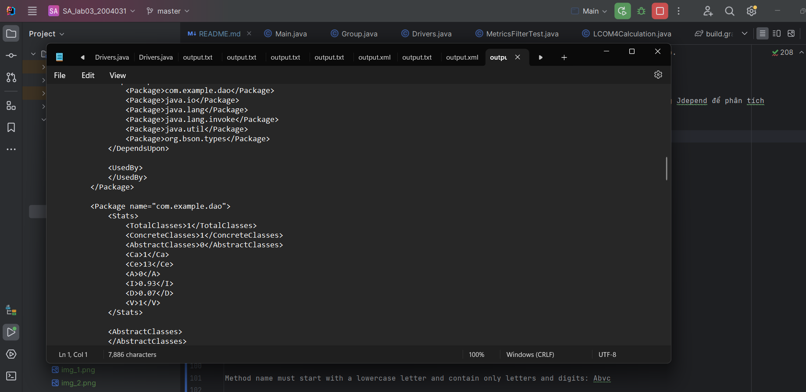

# Lab 03 - Kiến trúc và Thiết Kế Phần Mềm

## Yêu cầu đề bài 


## Các bước thực hiện

Dự án này sử dụng thư viện JDepend để phân tích dự án Java và tạo ra các tập tin XML chứa thông tin về các phụ thuộc giữa các gói trong dự án. Sau đó, chúng ta sẽ sử dụng thư viện XMLJ(API DOM) để phân tích các tập tin XML này và tạo ra báo cáo thống kê về tình trạng của các gói trong dự án.

Bước 1: Phân tích project bằng JDepend:

Sử dụng thư viện JDepend để phân tích project Java và thu thập thông tin về các phụ thuộc giữa các gói trong dự án.

Sử dụng JDepend để tạo các tập tin XML chứa thông tin về các phụ thuộc này.

Bước 2: Phân tích các tập tin XML bằng XMLJ (API DOM):

Sử dụng DocumentBuilderFactory để tạo một DocumentBuilder

Sử dụng DocumentBuilder để phân tích mỗi tập tin XML và tạo ra một Document tương ứng.

Trong mỗi Document, truy xuất và phân tích các phần tử và thuộc tính để thu thập thông tin về tình trạng của các gói trong dự án.

Bước 3: Tạo báo cáo thống kê về tình trạng của các gói trong dự án:

Dựa trên thông tin thu thập được từ các tập tin XML, tạo ra báo cáo thống kê về tình trạng của các gói trong dự án

Báo cáo này có thể bao gồm các thông tin của dự án đã được phân tích bằng Jdepend

Bước 4: Lưu báo cáo và tập tin XML:

Sau khi báo cáo được hoàn thành sẽ được lưu vào C:\Users\PC\Downloads và sẽ được thông báo cho bạn.

### Công Cụ và Thư Viện

- **JDepend** (https://github.com/clarkware/jdepend): Đây là thư viện JDepend, một công cụ phân tích mã nguồn Java để đo lường chất lượng mã, phụ thuộc và sự phức tạp của mã nguồn.

- **Apache Commons BCEL** (https://commons.apache.org/proper/commons-bcel/): là một thư viện để phân tích, tạo ra và sửa đổi mã bytecode Java.Được dùng để phân tích LCOM,WMC,LCOM4 từ các file .class(tham khảo ở Drivers.java,MetricsFilterTest.java)

- **CKJM** (https://github.com/dspinellis/ckjm): là một công cụ để đo lường sự phức tạp của mã nguồn Java bằng cách sử dụng các chỉ số phức tạp McCabe, Chidamber và Kemerer (C&K) và Halstead.

- **Java Architecture for XML Binding (JAXB)** (https://www.oracle.com/technical-resources/articles/javase/jaxb.html) là một API trong Java để ánh xạ các lớp Java vào các tài liệu XML và ngược lại.
### Sử Dụng

Thêm các phụ thuộc sau vào tệp cấu hình của dự án:

```groovy
implementation 'guru.nidi:jdepend:2.9.5'
implementation 'org.apache.bcel:bcel:6.8.1'
implementation 'gr.spinellis.ckjm:ckjm_ext:2.5'
implementation 'javax.xml.bind:jaxb-api:2.3.1'
implementation 'org.glassfish.jaxb:jaxb-runtime:2.3.3'
```

## Demo chương trình 

Sau khi download chương trình.Mở nó trong IDE ( recommend: Intellij)

Thưc hiện chạy ứng dụng ở file Main.java(\SA_lab03_20040301\src\main\java\org\example\Main.java)


Sau khi chạy Main.java,sẽ xuất hiện một GUI cho phép bạn chọn project cần kiểm tra 


Bạn có thể lựa chọn project cần kiểm tra. Ở đây đã tích hợp sẽ một project dùng để thực hiện test chương trình 


Sau khi chọn thành công project cần kiểm tra. Bạn nhấn open và đợi một vi giây để tools thực hiện kiểm tra 


Sau khi kiểm tra thành công, chương trình sẽ hiển thị một thông báo thành công và nơi lưu file báo cáo.


Ở file output.xml sẽ hiển thị ra các thông tin đã tạo ra khi dùng Jdepend để phân tích dưới dạng xml




Ở file output.xml sẽ hiển thị ra các thồng tin được parse từ file output.xml


Các báo cáo sẽ có những dạng sau : 

Đỏi với file XML 
```
<JDepend>
    <Packages>
        <Package name="com.example">
            <Stats>
                <TotalClasses>2</TotalClasses>
                <ConcreteClasses>2</ConcreteClasses>
                <AbstractClasses>0</AbstractClasses>
                <Ca>0</Ca>
                <Ce>3</Ce>
                <A>0</A>
                <I>1</I>
                <D>0</D>
                <V>1</V>
            </Stats>

            <AbstractClasses>
            </AbstractClasses>

            <ConcreteClasses>
                <Class sourceFile="App.java">
                    com.example.App
                </Class>
                <Class sourceFile="AppTest.java">
                    com.example.AppTest
                </Class>
            </ConcreteClasses>

            <DependsUpon>
                <Package>java.io</Package>
                <Package>java.lang</Package>
                <Package>org.junit</Package>
            </DependsUpon>

            <UsedBy>
            </UsedBy>
        </Package>
```

Đối với file txt

Package: com.example
Stats:
Total Classes: 2
Concrete Classes: 2
Abstract Classes: 0
Ca: 0
Ce: 3
A: 0
I: 1
D: 0
V: 1
- Class Source File: App.java
- Class Source File: AppTest.java

Package:
No statistics available for this package.
Package: com.mongodb.client.model
Error: No stats available: package referenced, but not analyzed.

Ngoài ra ở bạn có thể phân tích được chỉ số WMC và LCOM ở file MetricsFilterTest


và LCOM4 ở Drivers.java


